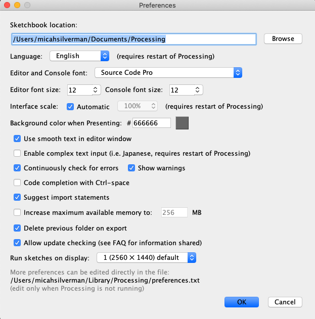

Java Library for blink(1)
-------------------------

### Build

```
./mvnw clean install
```

This builds a fat jar in: `blink1-library/target/blink1-library-jar-with-dependencies.jar`

### Java Examples

Examples that use the library can be found in the blink1-examples module

you can run an example from the command line (after building) with:

```
./run-example.sh Example<n>
```

(where `<n>` is: 0, 1, 2 or 3)

ex:

```
./run-example.sh Example0
Looking for blink(1) devices...
blink(1)s found:
i:0  serial:37ec9b94
```

There's also a basic program to turn off the blink1 or set it to a specific RGB value:

```
./run-example.sh OnOffColor
Turning off blink1.
```

```
./run-example.sh OnOffColor 255 0 0
Setting R(255)G(0)B(0) on blink1
```

```
./run-example.sh OnOffColor 255 bad 255
One or more of the rgb params is not a number between 0 and 255: r(255), g(bad), b(255)
```

### Processing Examples

The Processing IDE can be downloaded and installed from [here](https://processing.org/download/).

When you build the project, the blink(1) library is organized for use with Processing.

Simply move the `blink1-processing-examples/target/Blink1` folder to the Processing sketch libraries folder.

By default, the Processing sketch libraries folder can be found at: `~/Documents/Processing/libraries`

Here's an example of how you would get set up to run the Processing examples:

```bash
mv blink1-processing-examples/target/Blink1 ~/Documents/Processing/libraries
```  

Once the blink(1) library is in the right place for the Processing IDE, you can open any of the examples found in the
`blink1-processing-examples` folder.

You can verify that the blink(1) library is properly set up for the Processing IDE by navigating to: 
**Sketch > Import Library... >** and you'll see: `Blink1` under **Contributed**.


If you don't see the above in your own instance of the Processing IDE, make sure that the `Blink1` folder from
`blink1-processing-examples/target` has been copied to the correct location. You can verify where your Processing
IDE sketches location is on your local machine by locating the `Sketchbook location` setting in the preferences pane.



**NOTE:** If the Processing IDE was already running before you moved the `Blink1` folder over to the `libraries` folder,
you should exit and restart the Processing IDE.