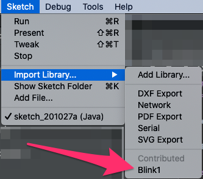

Example blink(1) Processing Sketches
====================================

These are examples of how to use the blink(1) Processing/Java library.

The Processing IDE can be downloaded and installed from [here](https://processing.org/download/).

## Using the blink(1) library with Processing

The default location for libraries for the Processing IDE is: `~/Documents/Processing/libraries`.

If you run:

```bash
./mvnw clean install
```

from the root folder, the `Blink1` library is automatically installed in the default location.

If you're Processing sketches folder is somewhere else, update the `processing.libraries.folder` property in the 
`pom.xml` file for this module.

When you open one of the `.pde` examples in this module in Processing IDE, the `Blink1` library should be available and 
you should not see any errors.

To confirm, Navigate to: **Sketch > Import Library... >** and you'll see: `Blink1` under **Contributed**.

